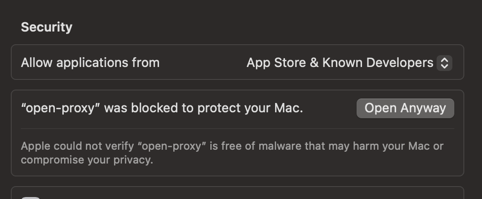
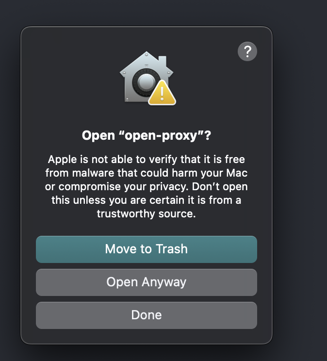
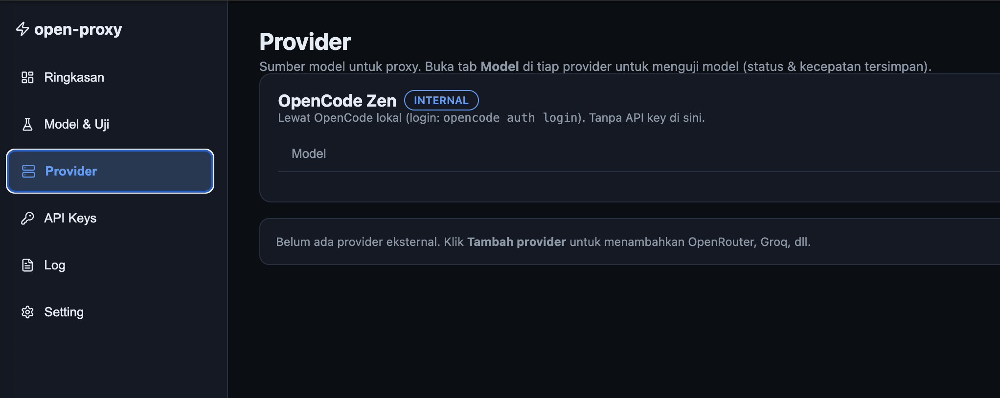
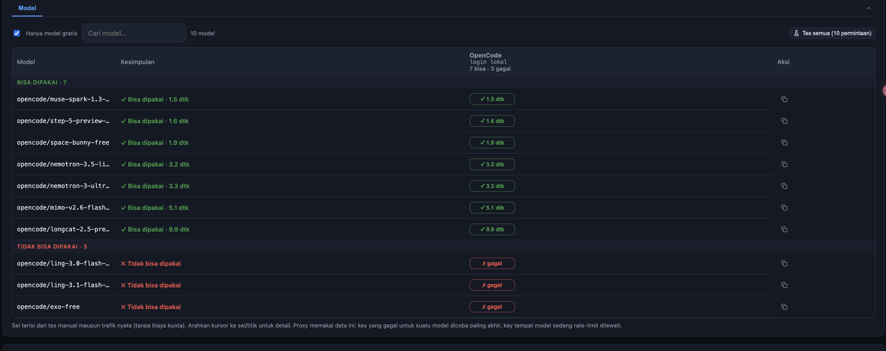
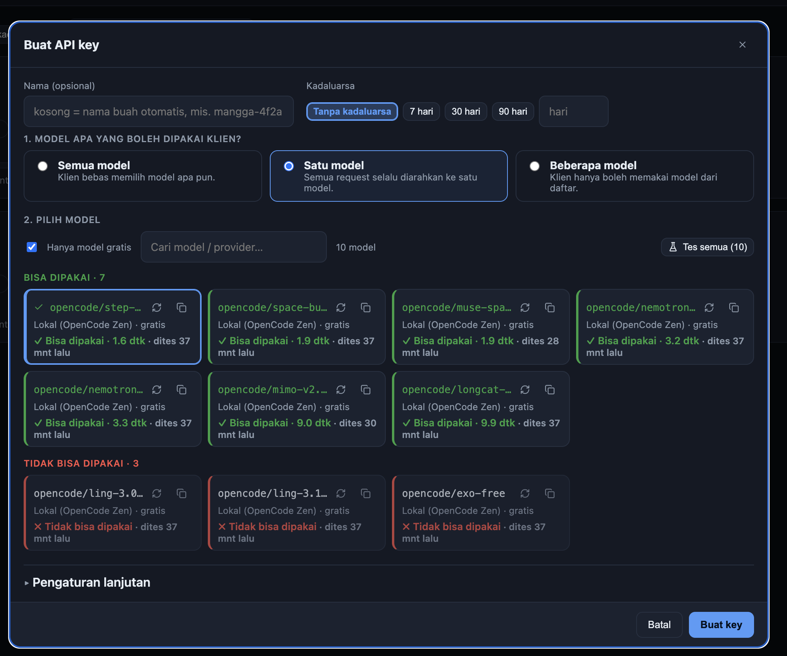

Install step by step

- Download file binary
- Buka system setting &gt; Privacy $ Security
- Scroll cari paling bawah open-proxy dan allow

- Jalankan: chmod +x open-proxy
- Jalankan: ./open-proxy start
- Klik Open Anyway ( pertama kali di jalankan )

Login

Email: [admin@demo.com](mailto:admin@demo.com)

Pass: admin123

Setelah masuk ke dashboard

- Ke halaman provider &gt; Klik model

- Klik Test manual

( Kalau belum mau update opencode, kalau belum ada download  di github: curl -fsSL [https://opencode.ai/install](https://opencode.ai/install) | bash )

- Ke halaman API Key &gt; Buat API Key

- Kadaluwarsa ~ ( unlimited )
- Model &gt; Satu model &gt; Buat Key

- Salin token ( simpan dan paste di tempat paling aman di device anda )

&nbsp;

Set di device

- Copy example env &gt; salin di folder yang sama dimana anda akan jalankan claude nya
- Jalankan envman -e .env.claude -- claude

